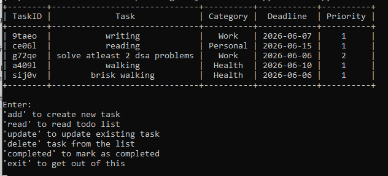

# ShellDo - CLI To Do list

A terminal-based To Do list application built using Python.

This project helps users:

* add new tasks
* view tasks
* mark tasks as completed
* update existing tasks
* delete tasks
* menu-driven interface
* search tasks by keyword

The project was built as part of a practical learning journey focused on improving:

* backend thinking
* project structuring
* debugging ability
* modular programming
* problem-solving

---

# Features

## Dynamic Task Storage

* Tasks are stored using Python data structures
* Supports adding and removing tasks dynamically during runtime
* Organized task records for efficient management

---

## Search & Filtering

Filter tasks based on:

* deadline of the tasks
* task categories

---

## Data Persistence

* Save tasks to a file
* Automatically load existing tasks when the application starts
* Prevent loss of task data between sessions

---

## Productivity Features

* Maintain daily task lists
* Track task completion progress
* Improve personal organization and productivity

---

## Error Handling

Robust validation system to prevent crashes from:

* invalid inputs
* wrong menu choices
* empty values
* unexpected user actions

The application allows users to re-enter values instead of terminating abruptly.

---

## Clean CLI User Interface

Implemented using PrettyTable for:

* formatted tables
* better readability
* structured terminal output

---

# Tech Stack

* Python
* JSON
* PrettyTable
* Questionary

---

# Project Structure

```text
SHELLDO/
│
├── add.py
├── delete.py
├── update.py
├── helper_functions.py
├── load_data.py
├── store_data.py
├── main.py
├── data.json
├── requirements.txt
└── README.md
```

---

# Installation

## Clone Repository

```bash
git clone https://github.com/raibhardwaj05/ShellDo.git
```

---

## Move Into Project Folder

```bash
cd ShellDo
```

---

## Install Requirements

```bash
pip install -r requirements.txt
```

---

# Run Application

```bash
python main.py
```

---

# Executable Version

The project can also be converted into a standalone executable using PyInstaller.

Example:

```bash
pyinstaller --onefile main.py
```

---

# Future Improvements

Possible future upgrades:

* SQLite database integration
* FastAPI backend version
* Authentication system
* Task completion statistics and analytics
* Data visualization using Matplotlib
* Export reports

---

# What I Learned From This Project

Through this project I practiced:

* modular programming
* project architecture and code organization
* CRUD operations (Create, Read, Update, Delete)
* JSON file handling
* data persistence across program sessions
* reading from and writing to files
* CLI application design
* menu-driven program flow
* input validation
* error handling and debugging
* working with lists and dictionaries
* function decomposition and reusability
* state management for task tracking
* separation of concerns
* maintainable and scalable code structure
* organizing business logic into independent modules

---

# Screenshots

## Main Menu



---

# Author

Bhardwaj Rai
